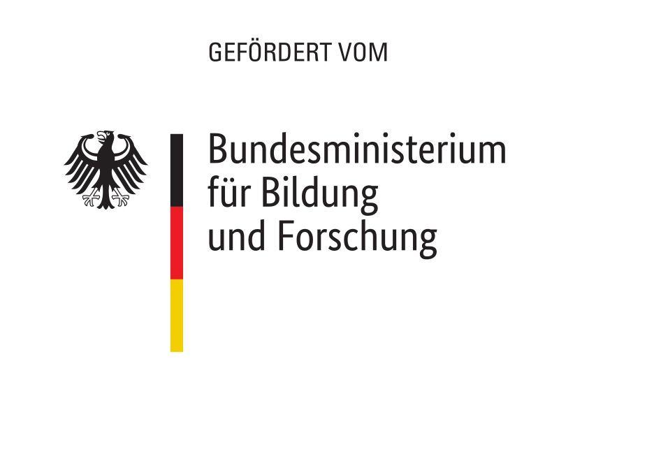

[](https://github.com/open-public-transport/open-public-transport-frontend/actions/workflows/build-app-workflow.yml)
[](https://github.com/open-public-transport/open-public-transport-frontend/issues)

<br />
<p align="center">
  <a href="https://github.com/open-public-transport/open-public-transport-frontend">
    
  </a>

  <h1 align="center">Open Public Transport (Frontend)</h1>

  <p align="center">
    Angular based web app that presents public transport analysis results 
  </p>
</p>

## About The Project

tbd

### Built With

* [Angular](https://angular.io/)
* [Mapbox](https://www.mapbox.com/)

## Installation

Install all packages by running

```
npm install
```

You can start the app locally by running

```
npm run start
```

## Usage

tbd

## Roadmap

See the [open issues](https://github.com/open-public-transport/open-public-transport-frontend/issues) for a list of proposed features (and
 known issues).

## Contributing

tbd

## Funding

Between September 2021 through February 2022 this project is founded by [German Federal Ministry of Education and Research](https://www.bmbf.de/bmbf/en/home/home_node.html) and supported by [Prototype Fund](https://prototypefund.de/).

<p align="center">
  <a href="https://www.bmbf.de/bmbf/en/home/home_node.html">
    
  </a>
  <a href="https://prototypefund.de/">
    
  </a>
</p>

## License

Distributed under the AGPLv3 License. See [LICENSE.md](./LICENSE.md) for more information.

## Contact

kontakt@openpublictransport.de
